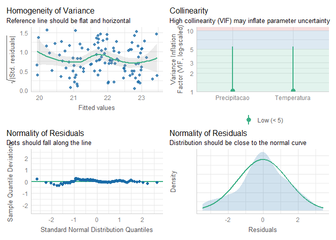
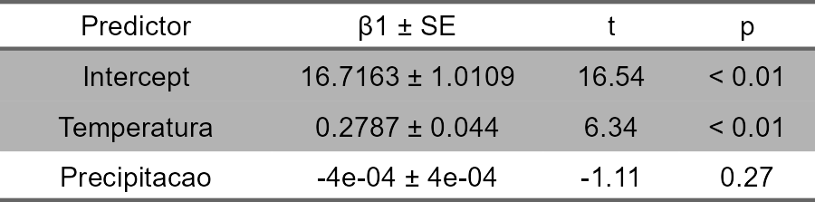

# How to make tables from lineare models in R

# Required packages

``` r
library(ecodados)

library(tidyverse)

library(performance)

library(flextable)
```

# Data

## Importing

``` r
data <- ecodados::regressoes
```

## Visualizing

``` r
data
```

    ##                  Municipio      CRC Temperatura Precipitacao
    ## 1                 Acorizal 22.98816    24.13000      1228.20
    ## 2              Alpinopolis 22.91788    20.09417      1487.60
    ## 3             Alto_Paraiso 21.97629    21.86167      1812.40
    ## 4                Americana 23.32453    20.28333      1266.20
    ## 5                  Apiacas 22.83651    25.47333      2154.00
    ## 6              Arianopolis 20.86989    20.12167      1269.20
    ## 7                 Aripuana 24.28687    24.49833      1940.60
    ## 8                  Atibaia 21.25543    16.84667      1460.40
    ## 9              Bairro_Alto 18.98987    17.71583      1784.20
    ## 10      Barra_do_Gar\xe7as 25.37757    25.30667      1584.60
    ## 11                Bertioga 19.31110    21.93646      2548.50
    ## 12                 Bocaina 20.61664    20.62417      1281.20
    ## 13              Bom_Jardim 22.59686    14.27583      1690.80
    ## 14                  Bonito 22.38359    23.65250      1361.80
    ## 15                   Borba 22.98383    18.41250      1376.40
    ## 16                Botucatu 22.13267    19.20667      1320.00
    ## 17               Brianorte 25.63334    24.83667      1956.00
    ## 18                    Buri 24.26716    19.62583      1194.60
    ## 19                Campinas 20.88495    19.31500      1314.40
    ## 20   Campo_Grande_da_Serra 21.30671    18.07500      1570.60
    ## 21             Campo_Verde 24.54060    22.57583      1717.60
    ## 22        Campos_do_Jordao 19.73177    14.35167      1807.40
    ## 23                 Carajas 24.69119    25.48000      1862.80
    ## 24               Carangola 18.88412    19.97917      1301.40
    ## 25          Carlos_Botelho 21.20319    17.65500      1370.40
    ## 26       Chapada_Damantina 23.61192    20.64667       656.00
    ## 27   Chapada_dos_Guimaraes 22.61132    23.01833      1553.20
    ## 28                Cianorte 24.25226    20.61500      1392.00
    ## 29   Concei\xe7ao_da_Barra 19.57501    24.07604      1346.75
    ## 30              Corumbatai 21.94591    19.98917      1327.00
    ## 31              Costa_Rica 21.92938    23.25583      1586.40
    ## 32            Cruz_Machado 22.91027    16.68000      1686.40
    ## 33                   Cunha 18.39017    15.22000      1740.60
    ## 34              Diamantina 22.79613    24.36917      1674.80
    ## 35                Eldorado 21.53262    22.11917      1541.60
    ## 36                    Emas 22.07035    20.82000      1169.60
    ## 37   Ferraz_de_Vasconcelos 21.34151    17.66833      1519.80
    ## 38     General_Carneiro_MT 24.24069    23.73417      1555.00
    ## 39     General_Carneiro_PR 22.52715    16.03917      1694.20
    ## 40                 Humaita 22.15159    26.46500      2193.40
    ## 41               Ibitipoca 17.63471    18.04000      1581.00
    ## 42                  Ibiuna 20.12142    17.22000      1500.80
    ## 43                    Icem 22.99430    23.55917      1270.80
    ## 44              Intervales 21.09071    17.61917      1402.20
    ## 45                Iporanga 22.81890    21.58667      1441.60
    ## 46                Itanhaem 21.29179    22.72167      2141.20
    ## 47               Itanhanga 23.57696    25.50917      2128.60
    ## 48    Itapecerica_da_Serra 20.74674    17.52250      1663.20
    ## 49               Itirapina 21.97101    19.72333      1370.00
    ## 50                     Itu 19.59776    19.52833      1274.80
    ## 51           Jaboticatubas 19.00923    21.10000      1408.00
    ## 52            Jacareacanga 22.91148    25.93417      2305.00
    ## 53                  Jureia 20.90551    21.06250      1936.20
    ## 54                   Lages 21.49883    16.44667      1452.40
    ## 55                  Manaus 20.46372    27.45417      2156.60
    ## 56                Miracatu 21.36892    21.70417      1684.60
    ## 57              Monte_Alto 22.25566    21.67500      1323.20
    ## 58                  Nobres 23.52074    24.87167      1515.80
    ## 59         Nova_Alian\xe7a 22.18330    22.64000      1173.00
    ## 60       Nova_Bandeirantes 23.49566    25.16583      2074.60
    ## 61           Nova_Friburgo 21.07678    17.94833      1422.20
    ## 62               Nova_Lima 23.45591    20.21417      1438.80
    ## 63            Nova_Maringa 24.77272    25.19917      1963.60
    ## 64              Nova_Mutum 24.60689    25.50000      1926.80
    ## 65               Palestina 21.12676    23.08917      1236.20
    ## 66               Palmeiras 23.16977    21.45167       849.20
    ## 67               Paranaita 22.96722    25.43000      2293.80
    ## 68           Paranapiacaba 21.53567    17.16083      2810.60
    ## 69             Passos_Maia 20.01541    16.23167      2033.20
    ## 70     PESM_Santa_Virginia 19.28117    17.34333      1863.20
    ## 71              Petropolis 20.16381    18.66167      1871.80
    ## 72              Picinguaba 19.57797    21.32167      2201.20
    ## 73                  Piraju 22.87094    20.30083      1265.40
    ## 74            Pirassununga 22.64363    20.63750      1249.40
    ## 75            PN_Guimaraes 22.43550    23.90417      1393.00
    ## 76      Po\xe7os_de_Caldas 20.43750    17.99917      1680.20
    ## 77       Porto_dos_Gauchos 23.96373    25.32000      1989.80
    ## 78          Porto_Nacional 23.20726    26.19583      1622.20
    ## 79      Primavera_do_Leste 23.88607    22.29833      1773.00
    ## 80         Ribeirao_Branco 21.12958    17.85083      1350.20
    ## 81         Ribeirao_Grande 21.74494    18.40500      1295.00
    ## 82          Ribeirao_Pires 20.45368    17.19000      2048.20
    ## 83          Ribeirao_Preto 21.22772    21.52250      1495.20
    ## 84           Rio_Brilhante 20.56855    23.76917      1442.60
    ## 85               Rio_Claro 21.40647    20.18167      1307.60
    ## 86    Santa_Maria_Madalena 19.82553    19.04583      1404.20
    ## 87     Santana_do_Parnaiba 21.72944    18.26500      1392.40
    ## 88     Santissima_Trindade 23.16251    24.42917      1359.60
    ## 89            Sao_Bernardo 21.98871    17.73667      1560.20
    ## 90             Sao_Caetano 20.23071    18.16833      1353.00
    ## 91  Sao_Francisco_de_Paula 23.65128    15.72167      2054.80
    ## 92   Sao_Jose_do_Rio Claro 24.29360    25.40333      1915.80
    ## 93   Sao_Jose_do_Rio_Preto 22.01852    22.64333      1261.40
    ## 94    Sao_Jose_dos_Pinhais 20.90781    17.03917      1295.20
    ## 95                Sao_Luis 23.26290    27.09000      1892.20
    ## 96               Sao_Paulo 20.97315    18.52250      1354.60
    ## 97           Sao_Sebastiao 20.33593    22.46042      2425.25
    ## 98        Serra_da_Bocaina 19.34083    14.28500      1813.00
    ## 99                 Tapurah 23.38075    25.60667      2006.40
    ## 100                Taubate 19.16743    18.31000      1469.20
    ## 101                Tiangua 23.22831    21.96667      1295.20
    ## 102         Tijucas_do_Sul 21.76303    16.18250      1495.40
    ## 103            Tres_Marias 22.45418    23.22167      1231.60
    ## 104                Ubatuba 20.88354    21.59750      2460.00
    ## 105             Uberlandia 21.20191    21.51833      1482.80
    ## 106            Vargem_Alta 19.50810    20.82750      1229.40
    ## 107              Vi\xe7osa 18.75715    20.15417      1259.20
    ## 108           Vila_Paredao 23.68528    22.75250      1682.20
    ## 109         Vitoria_Brasil 22.93436    22.54833      1187.00

# Modeling

## Creating a linear model

``` r
linear_model <- lm(CRC ~.,
                   data = data[, 2:4]) 
```

## Check assuptions

``` r
linear_model |> performance::check_normality()
```

    ## OK: residuals appear as normally distributed (p = 0.325).

``` r
linear_model |> performance::check_heteroscedasticity()
```

    ## OK: Error variance appears to be homoscedastic (p = 0.565).

``` r
linear_model |> performance::check_model(check = c("vif",
                                                   "homogeneity",
                                                   "qq",
                                                   "normality"))
```

<!-- -->

## Model statistics

``` r
linear_model |> 
  summary()
```

    ## 
    ## Call:
    ## lm(formula = CRC ~ ., data = data[, 2:4])
    ## 
    ## Residuals:
    ##     Min      1Q  Median      3Q     Max 
    ## -3.4351 -0.8026  0.0140  0.9420  3.4300 
    ## 
    ## Coefficients:
    ##                Estimate Std. Error t value Pr(>|t|)    
    ## (Intercept)  16.7162571  1.0108674  16.537  < 2e-16 ***
    ## Temperatura   0.2787445  0.0439601   6.341 5.71e-09 ***
    ## Precipitacao -0.0004270  0.0003852  -1.108     0.27    
    ## ---
    ## Signif. codes:  0 '***' 0.001 '**' 0.01 '*' 0.05 '.' 0.1 ' ' 1
    ## 
    ## Residual standard error: 1.44 on 106 degrees of freedom
    ## Multiple R-squared:  0.2751, Adjusted R-squared:  0.2614 
    ## F-statistic: 20.12 on 2 and 106 DF,  p-value: 3.927e-08

# Statistics table

## Making a dataframe with summary statístics

``` r
summary_table <- linear_model |> 
  summary()

summary_table <- summary_table$coefficients |> 
  as.data.frame() |> 
  tibble::rownames_to_column()

summary_table
```

    ##        rowname      Estimate   Std. Error   t value     Pr(>|t|)
    ## 1  (Intercept) 16.7162571282 1.0108673944 16.536548 4.012579e-31
    ## 2  Temperatura  0.2787444738 0.0439601090  6.340850 5.709022e-09
    ## 3 Precipitacao -0.0004269526 0.0003852369 -1.108286 2.702468e-01

## Editing the table

``` r
summary_table_trat <- summary_table |>
  dplyr::mutate(Estimate = Estimate |> round(4),
                `Std. Error` = `Std. Error` |> round(4),
                `t value` = `t value` |> round(2),
                `Pr(>|t|)` = dplyr::case_when(`Pr(>|t|)` < 0.01 ~ "< 0.01",
                                              .default = `Pr(>|t|)` |> 
                                                round(3) |> 
                                                as.character()),
                rowname = rowname |> stringr::str_remove_all("\\(|\\)")) |> 
  tidyr::unite(2:3,
               col = "β1 ± SE",
               sep = " ± ") |> 
  dplyr::rename("Predictor" = rowname,
                "t" = `t value`,
                "p" = `Pr(>|t|)`)

summary_table_trat
```

    ##      Predictor          β1 ± SE     t      p
    ## 1    Intercept 16.7163 ± 1.0109 16.54 < 0.01
    ## 2  Temperatura   0.2787 ± 0.044  6.34 < 0.01
    ## 3 Precipitacao   -4e-04 ± 4e-04 -1.11   0.27

# Turning into a flextable

``` r
summary_flex <- summary_table_trat |> 
  flextable::flextable() |> 
  flextable::align(align = "center", part = "all") |> 
  flextable::width(width = 1.5) |> 
  flextable::width(width = 0.75, j = 3:4) |> 
  flextable::bg(bg = "white", part = "all") |> 
  flextable::bg(i = ~p < 0.05,
                bg = "gray70")

summary_flex
```



## Exporting

``` r
summary_flex |> 
  flextable::save_as_docx(path = "linear_modelo_table.docx")
```
